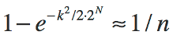
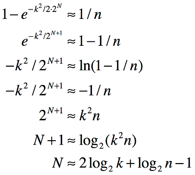

# EntropyString for Elixir

Efficiently generate cryptographically strong random strings of specified entropy from various character sets.

[](https://travis-ci.org/EntropyString/Elixir) &nbsp; [](https://hex.pm/packages/entropy_string) &nbsp; []()

### <a name="TOC"></a>TOC
 - [Installation](#Installation)
 - [Usage](#Usage)
 - [Overview](#Overview)
 - [Real Need](#RealNeed)
 - [Character Sets](#CharacterSets)
 - [Custom Characters](#CustomCharacters)
 - [Efficiency](#Efficiency)
 - [Custom Bytes](#CustomBytes)
 - [Entropy Bits](#EntropyBits)
 - [Why You Don't Need UUIDs](#UUID)
 - [Take Away](#TakeAway)

### Installation

Add `entropy_string` to `mix.exs` dependencies:

  ```elixir
  def deps do
    [ {:entropy_string, "~> 1.3"} ]
  end
  ```

Update dependencies

  ```bash
  mix deps.get
  ```

[TOC](#TOC)

### <a name="Usage"></a>Usage

Generate a potential of _10 million_ random strings with _1 in a trillion_ chance of repeat:

  ```elixir
  iex> import EntropyString
  EntropyString
  iex> defmodule(Id, do: use(EntropyString, total: 10.0e6, risk: 1.0e12))
  iex> Id.random()
  "JhD7L4343P34TTL9NQ"
  ```

`EntropyString` uses predefined `charset32` characters by default (reference [Character Sets](#CharacterSets)). To get a random hexadecimal string with the same entropy bits as above (see [Real Need](#RealNeed) for a description of how `total` and `risk` determine entropy bits):

  ```elixir
  iex> defmodule(Hex, do: use(EntropyString, total: 10.0e6, risk: 1.0e12, charset: charset16))
  iex> Hex.random()
  "03a4d43502c45b0f87fb3c"
  ```

Custom characters may be specified. Using uppercase hexadecimal characters:

  ```elixir
  iex> defmodule(UpperHex, do: use(EntropyString, charset: "0123456789ABCDEF"))
  iex> UpperHex.random()
  "C0B861E48CFB270738A4B6D54DA8E768"
  ```

Note that in the absence of specifying `total` and `risk` a default of 128 bits of entropy is used.

Convenience functions exists for a variety of random string needs. For example, to create OWASP session ID using predefined base 32 characters:

  ```elixir
  iex> defmodule(Server, do: use(EntropyString))
  iex> Server.session()
  "rp7D4hGp2QNPT2FP9q3rG8tt29"
  ```

Or a 256 bit token using [RFC 4648](https://tools.ietf.org/html/rfc4648#section-5) file system and URL safe characters:

  ```elixir
  iex> defmodule(Generator, do: use(EntropyString))
  iex> Generator.token()
  "X2AZRHuNN3mFUhsYzHSE_r2SeZJ_9uqdw-j9zvPqU2O"
  ```

The function `bits/0` reveals the entropy bits in use by a module:

  ```elixir
  iex> defmodule(Id, do: use(EntropyString, total: 1.0e9, risk: 1.0e15))
  iex> Id.bits()
  "108.6"
  iex> Id.string()
  "9LtmpbG2TPq9NGjdq99BpQ"
  ```

The function `string/0` is an alias for `random/0`. 

The function `chars/0` reveals the characters in use by the module:

  ```elixir
  iex> defmodule(Id, do: use(EntropyString, bits: 96, charset: charset32))
  EntropyString
  iex> Id.chars()
  "2346789bdfghjmnpqrtBDFGHJLMNPQRT"
  iex> Id.string()
  "JrftFNmJ8gHhRBp9f7dJ"
  ```

#### Examples

The `examples.exs` file contains a smattering of example uses:

  ```bash
  > iex --dot-iex iex.exs
  Erlang/OTP ...
  EntropyString Loaded

  Results of executing examples.exs file
  --------------------------------------

  Id: Predefined base 32 CharSet
    Bits:       128
    Characters: 2346789bdfghjmnpqrtBDFGHJLMNPQRT
    Random ID:  L42P32Ldj6L8JdTTdt2HtHnp68

  Hex: Predefined hex characters
    Bits:       128
    Characters: 0123456789abcdef
    Random ID:  75f5758c1225a8417f186e66a4778188

  Base64Id: Predefined URL and file system safe character session id
    Characters: ABCDEFGHIJKLMNOPQRSTUVWXYZabcdefghijklmnopqrstuvwxyz0123456789-_
    Session ID: KdGziqwcDFZJJL43boV85J

  UpperHex: Uppercase hex characters
    Bits:       64
    Characters: 0123456789ABCDEF
     ID:        CCDBFD3A05C087D4

  DingoSky: Custom characters for 10 million IDs with a 1 in a billion chance of repeat
    Bits:       75.4
    Characters: dingosky
    Random ID:  yodynyykgskgoodoiyidnkssnd
    
  Server: 256 entropy bit token
    Characters: ABCDEFGHIJKLMNOPQRSTUVWXYZabcdefghijklmnopqrstuvwxyz0123456789-_
    Token:      RtJosJEgOmA0oy8wPyUGju6SeJhCDJslTPUlVbRJgRM
  ```

Further investigations can use the modules defined in `examples.exs`:

  ```elixir
  ES-iex> Hex.medium()
  "e092b3e3e13704681f"
  ES-iex> DingoSky.medium()
  "ynssinoiosgignoiokgsogk"
  ES-iex> WebServer.token()
  "mT2vN607xeJy8qzVElnFbCpCyYpuWrYRRKbtTsNI6RN"
  ```

[TOC](#TOC)

### <a name="Overview"></a>Overview

`EntropyString` provides easy creation of randomly generated strings of specific entropy using various character sets. Such strings are needed as unique identifiers when generating, for example, random IDs and you don't want the overkill of a UUID.

A key concern when generating such strings is that they be unique. Guaranteed uniqueness, however, requires either deterministic generation (e.g., a counter) that is not random, or that each newly created random string be compared against all existing strings. When randomness is required, the overhead of storing and comparing strings is often too onerous and a different tack is chosen.

A common strategy is to replace the **_guarantee of uniqueness_** with a weaker but often sufficient one of **_probabilistic uniqueness_**. Specifically, rather than being absolutely sure of uniqueness, we settle for a statement such as *"there is less than a 1 in a billion chance that two of my strings are the same"*. We use an implicit version of this very strategy every time we use a hash set, where the keys are formed from taking the hash of some value. We *assume* there will be no hash collision using our values, but we **do not** have any true guarantee of uniqueness per se.

Fortunately, a probabilistic uniqueness strategy requires much less overhead than guaranteed uniqueness. But it does require we have some manner of qualifying what we mean by *"there is less than a 1 in a billion chance that 1 million strings of this form will have a repeat"*.

Understanding probabilistic uniqueness of random strings requires an understanding of [*entropy*](https://en.wikipedia.org/wiki/Entropy_(information_theory)) and of estimating the probability of a [*collision*](https://en.wikipedia.org/wiki/Birthday_problem#Cast_as_a_collision_problem) (i.e., the probability that two strings in a set of randomly generated strings might be the same). The blog post [Hash Collision Probabilities](http://preshing.com/20110504/hash-collision-probabilities/) provides an excellent overview of deriving an expression for calculating the probability of a collision in some number of hashes using a perfect hash with an N-bit output. This is sufficient for understanding the probability of collision given a hash with a **fixed** output of N-bits, but does not provide an answer to qualifying what we mean by *"there is less than a 1 in a billion chance that 1 million strings of this form will have a repeat"*. The [Entropy Bits](#EntropyBits) section below describes how `EntropyString` provides this qualifying measure.

We'll begin investigating `EntropyString` by considering the [Real Need](#RealNeed) when generating random strings.

[TOC](#TOC)

### <a name="RealNeed"></a>Real Need

Let's start by reflecting on the common statement: *I need random strings 16 characters long.*

Okay. There are libraries available that address that exact need. But first, there are some questions that arise from the need as stated, such as:

  1. What characters do you want to use?
  2. How many of these strings do you need?
  3. Why do you need these strings?

The available libraries often let you specify the characters to use. So we can assume for now that question 1 is answered with:

*Hexadecimal will do fine*.

As for question 2, the developer might respond:

*I need 10,000 of these things*.

Ah, now we're getting somewhere. The answer to question 3 might lead to a further qualification:

*I need to generate 10,000 random, unique IDs*.

And the cat's out of the bag. We're getting at the real need, and it's not the same as the original statement. The developer needs *uniqueness* across a total of some number of strings. The length of the string is a by-product of the uniqueness, not the goal, and should not be the primary specification for the random string.

As noted in the [Overview](#Overview), guaranteeing uniqueness is difficult, so we'll replace that declaration with one of *probabilistic uniqueness* by asking a fourth question:

<ol start=4>
  <li>What risk of a repeat are you willing to accept?</li>
</ol>

Probabilistic uniqueness contains risk. That's the price we pay for giving up on the stronger declaration of garuanteed uniqueness. But the developer can quantify an appropriate risk for a particular scenario with a statement like:

*I guess I can live with a 1 in a million chance of a repeat*.

So now we've finally gotten to the developer's real need:

*I need 10,000 random hexadecimal IDs with less than 1 in a million chance of any repeats*.

Not only is this statement more specific, there is no mention of string length. The developer needs probabilistic uniqueness, and strings are to be used to capture randomness for this purpose. As such, the length of the string is simply a by-product of the encoding used to represent the required uniqueness as a string.

How do you address this need using a library designed to generate strings of specified length?  Well, you don't, because that library was designed to answer the originally stated need, not the real need we've uncovered. We need a library that deals with probabilistic uniqueness of a total number of some strings. And that's exactly what `EntropyString` does.

Let's use `EntropyString` to help this developer generate 5 hexadecimal IDs from a pool of a potentail 10,000 IDs with a 1 in a milllion chance of a repeat:

  ```elixir
  iex> defmodule(Id, do: use(EntropyString, total: 10_000, risk: 1.0e6, charset: charset16))
  iex> Id.bits()
  45.5
  iex> for x <- :lists.seq(1,5), do: Id.random()
  ["85e442fa0e83", "a74dc126af1e", "368cd13b1f6e", "81bf94e1278d", "fe7dec099ac9"]
  ```

Examining the above code, the `total` and `risk` values determine the amount of entropy needed, which is about 45.5 bits, and a `charset` of `charset16` specifies the use of hexidecimal characters. Then Ids are then generated using `Id.random/0`.

Looking at the output, we can see each Id is 12 characters long. Again, the string length is a by-product of the characters (hex) used to represent the entropy (45.5 bits) we needed. And it seems the developer didn't really need 16 characters after all.

[TOC](#TOC)

### <a name="CharacterSets"></a>Character Sets

As we\'ve seen in the previous sections, `EntropyString` provides predefined characters for each of the supported character set lengths. Let\'s see what\'s under the hood. The predefined `CharSet`s are *charset64*, *charset32*, *charset16*, *charset8*, *charset4* and *charset2*. The characters for each were chosen as follows:

  - CharSet 64: **ABCDEFGHIJKLMNOPQRSTUVWXYZabcdefghijklmnopqrstuvwxyz0123456789-_**
      * The file system and URL safe char set from [RFC 4648](https://tools.ietf.org/html/rfc4648#section-5).
      &nbsp;
  - CharSet 32: **2346789bdfghjmnpqrtBDFGHJLMNPQRT**
      * Remove all upper and lower case vowels (including y)
      * Remove all numbers that look like letters
      * Remove all letters that look like numbers
      * Remove all letters that have poor distinction between upper and lower case values.
      The resulting strings don't look like English words and are easy to parse visually.
      &nbsp;
  - CharSet 16: **0123456789abcdef**
      * Hexadecimal
      &nbsp;
  - CharSet  8: **01234567**
      * Octal
      &nbsp;
  - CharSet  4: **ATCG**
      * DNA alphabet. No good reason; just wanted to get away from the obvious.
      &nbsp;
  - CharSet  2: **01**
      * Binary

You may, of course, want to choose the characters used, which is covered next in [Custom Characters](#CustomCharacters).

[TOC](#TOC)

### <a name="CustomCharacters"></a>Custom Characters

Being able to easily generate random strings is great, but what if you want to specify your own characters? For example, suppose you want to visualize flipping a coin to produce 10 bits of entropy.

  ```elixir
  iex> defmodule Coin do
  ...>   use EntropyString, charset: :charset2
  ...>   def flip(flips), do: Coin.random(flips)
  ...> end
  {:module, Coin,
     ...

  iex> Coin.flip(10)
  "0100101011"
  ```

The resulting string of __0__'s and __1__'s doesn't look quite right. Perhaps you want to use the characters __H__ and __T__ instead.

  ```elixir
  iex> defmodule Coin do
  ...>   use EntropyString, charset: "HT"
  ...>   def flip(flips), do: Coin.random(flips)
  ...> end
  {:module, Coin,
     ...

  iex> Coin.flip(10)
  "HTTTHHTTHH"
  ```

As another example, we saw in [Character Sets](#CharacterSets) the predefined hex characters for `charSet16` are lowercase. Suppose you like uppercase hexadecimal letters instead.

  ```elixir
  iex> defmodule(Hex, do: use(EntropyString, charset: "0123456789ABCDEF", bits: 192))
  {:module, Hex,
     ...
  iex> Hex.string()
  "73057082B6039721275A0F07A253EDD40FD7AB511DF0C44A"
  ```

To facilitate [efficient](#Efficiency) generation of strings, `EntropyString` limits character set lengths to powers of 2. Attempting to use a character set of an invalid length returns an error.

  ```elixir
  iex> EntropyString.random(:medium, "123456789ABCDEF")
  {:error, "Invalid char count: must be one of 2,4,8,16,32,64"}
  ```

Likewise, since calculating entropy requires specification of the probability of each symbol, `EntropyString` requires all characters in a set be unique. (This maximize entropy per string as well).

  ```elixir
  iex> EntropyString.random(:medium, "123456789ABCDEF1")
  {:error, "Chars not unique"}
  ```

[TOC](#TOC)

### <a name="Efficiency"></a>Efficiency

To efficiently create random strings, `EntropyString` generates the necessary number of random bytes needed for each string and uses those bytes in a binary pattern matching scheme to index into a character set. For example, to generate strings from the __32__ characters in the *charSet32* character set, each index needs to be an integer in the range `[0,31]`. Generating a random string of *charSet32* characters is thus reduced to generating random indices in the range `[0,31]`.

To generate the indices, `EntropyString` slices just enough bits from the random bytes to create each index. In the example at hand, 5 bits are needed to create an index in the range `[0,31]`. `EntropyString` processes the random bytes 5 bits at a time to create the indices. The first index comes from the first 5 bits of the first byte, the second index comes from the last 3 bits of the first byte combined with the first 2 bits of the second byte, and so on as the bytes are systematically sliced to form indices into the character set. And since binary pattern matching is really efficient, this scheme is quite fast.

The `EntropyString` scheme is also efficient with regard to the amount of randomness used. Consider the following possible Elixir solution to generating random strings. To generated a character, an index into the available characters is created using `Enum.random`. The code looks something like:

  ```elixir
  iex> defmodule MyString do
  ...>   @chars "abcdefghijklmnopqrstuvwxyz0123456"
  ...>   @max String.length(@chars)-1
  ...>
  ...>   defp random_char do
  ...>     ndx = Enum.random 0..@max
  ...>     String.slice @chars, ndx..ndx
  ...>   end
  ...>
  ...>   def random_string(len) do
  ...>     list = for _ <- :lists.seq(1,len), do: random_char
  ...>     List.foldl(list, "", fn(e,acc) -> acc <> e end)
  ...>   end
  ...> end
  {:module, MyString,
     ...
  iex> MyString.random_string 16
  "j0jaxxnoipdgksxi"
  ```

In the code above, `Enum.random` generates a value used to index into the hexadecimal character set. The Elixir docs for `Enum.random` indicate it uses the Erlang `rand` module, which in turn indicates that each random value has 58 bits of precision. Suppose we're creating strings with **len = 16**. Generating each string character consumes 58 bits of randomness while only injecting 5 bits (`log2(32)`) of entropy into the resulting random string. The resulting string has an information carrying capacity of 16 * 5 = 80 bits, so creating each string requires a *total* of 928 bits of randomness while only actually *carrying* 80 bits of that entropy forward in the string itself. That means 848 bits (91%) of the generated randomness is simply wasted.

Compare that to the `EntropyString` scheme. For the example above, plucking 5 bits at a time requires a total of 80 bits (10 bytes) be available. Creating the same strings as above, `EntropyString` uses 80 bits of randomness per string with no wasted bits. In general, the `EntropyString` scheme can waste up to 7 bits per string, but that's the worst case scenario and that's *per string*, not *per character*!

There is, however, a potentially bigger issue at play in the above code. Erlang `rand`, and therefor Elixir `Enum.random`, does not use a cryptographically strong psuedo random number generator. So the above code should not be used for session IDs or any other purpose that requires secure properties.

There are certainly other popular ways to create random strings, including secure ones. For example, generating secure random hex strings can be done by

  ```elixir
  iex> Base.encode16(:crypto.strong_rand_bytes(8))
  "389B363BB7FD6227"
  ```

Or, to generate file system and URL safe strings

  ```elixir
  iex> Base.url_encode64(:crypto.strong_rand_bytes(8))
  "5PLujtDieyA="
  ```

Since Base64 encoding is concerned with decoding as well, you would have to strip any padding characters. That's the price we pay for using a function for something it wasn't designed for.

These two solutions each have limitations. You can't alter the characters, but more importantly, each lacks a clear specification of how random the resulting strings actually are. Each specifies a number of bytes as opposed to specifying the entropy bits sufficient to represent some total number of strings with an explicit declaration of an associated risk of repeat using whatever encoding characters you want. That's a bit of a mouthful, but the important point is with `EntropyString` you _explicitly_ declare your intent.

Fortunately you don't need to really understand how secure random bytes are efficiently sliced and diced to use `EntropyString`. But you may want to provide your own [Custom Bytes](#CustomBytes), which is the next topic.

[TOC](#TOC)

### <a name="CustomBytes"></a>Custom Bytes

As previously described, `EntropyString` automatically generates cryptographically strong random bytes to generate strings. You may, however, have a need to provide your own bytes, for deterministic testing or perhaps to use a specialized random byte generator.

Suppose we want 30 strings with no more than a 1 in a million chance of repeat while using 32 characters. We can specify the bytes to use during string generation by

  ```elixir
  iex> bytes = <<0xfa, 0xc8, 0x96, 0x64>>
  <<250, 200, 150, 100>>
  iex> EntropyString.random(:small, :charset32, bytes)
  "Th7fjL"
  ```

The __bytes__ provided can come from any source. However, an error is returned if the number of bytes is insufficient to generate the string as described in the [Efficiency](#Efficiency) section:

  ```elixir
  iex> EntropyString.random(:large, :charset32, bytes)
  {:error, "Insufficient bytes: need 14 and got 4"}
  ```

`EntropyString.CharSet.bytes_needed/2` can be used to determine the number of bytes needed to cover a specified amount of entropy for a given character set.

  ```elixir
  iex> EntropyString.CharSet.bytes_needed(:large, :charset32)
  13
  ```

[TOC](#TOC)

### <a name="EntropyBits"></a>Entropy Bits

Thus far we've avoided the mathematics behind the calculation of the entropy bits required to specify a risk that some number random strings will not have a repeat. As noted in the [Overview](#Overview), the posting [Hash Collision Probabilities](http://preshing.com/20110504/hash-collision-probabilities/) derives an expression, based on the well-known [Birthday Problem](https://en.wikipedia.org/wiki/Birthday_problem#Approximations), for calculating the probability of a collision in some number of hashes (denoted by `k`) using a perfect hash with an output of `M` bits:


There are two slight tweaks to this equation as compared to the one in the referenced posting. `M` is used for the total number of possible hashes and an equation is formed by explicitly specifying that the expression in the posting is approximately equal to `1/n`.

More importantly, the above equation isn't in a form conducive to our entropy string needs. The equation was derived for a set number of possible hashes and yields a probability, which is fine for hash collisions but isn't quite right for calculating the bits of entropy needed for our random strings.

The first thing we'll change is to use `M = 2^N`, where `N` is the number of entropy bits. This simply states that the number of possible strings is equal to the number of possible values using `N` bits:



Now we massage the equation to represent `N` as a function of `k` and `n`:



The final line represents the number of entropy bits `N` as a function of the number of potential strings `k` and the risk of repeat of 1 in `n`, exactly what we want. Furthermore, the equation is in a form that avoids really large numbers in calculating `N` since we immediately take a logarithm of each large value `k` and `n`.

[TOC](#TOC)

### <a name="UUID"></a>Why You Don't Need UUIDs

It is quite common in the JavaScript community, and other languages as well, to simply use string representations of UUIDs as random strings. While this isn't necessarily wrong, it is not efficient. It's somewhat akin to using a BigInt library to do math with small integers. The answers might be right, but the process seems wrong.

By UUID, we almost always mean the version 4 string representation, which looks like this:

```
  hhhhhhhh-hhhh-4hhh-Mhhh-hhhhh
```

Per [Section 4.4 of RFC 4122](https://tools.ietf.org/html/rfc4122#section-4.4), the algorithm for creating 32-byte version 4 UUIDs is:

  - Set bits 49-52 to the 4-bit version number, **0100**
    - The 13th hex char will always be **4**
  - Set bit 65-66 to **10**.
    - The 17th hex char will be one of **8**, **9**, **A** or **B**
  - Set all the other bits to randomly (or pseudo-randomly) chosen values

The algorithm designates how to create the 32 byte UUID. The string representation shown above is specified in Section 3 of the RFC. 

The ramifications of the algorithm and string representation are:

  - The specification does not require the use of a cryptographically strong pseudo-random number generator. That's fine, but if using the IDs for security purposes, be sure a CSPRNG is being used to generate the random bytes for the UUID.
  - Because certain bits are fixed values, the entropy of the UUID is reduced from 128 bits to 122 bits. This may not be a significant issue in some cases, but regardless of how often you read otherwise, a version 4 UUID **_does not have_** 128 bits of randomness. And if you use version 4 UUIDs for session IDs, that does not cover the OWASP recommendation of using 128-bit IDs.
  - The string representation with hyphens adds overhead without adding any bits of entropy.

As a quick aside, let me emphasize that a string **_does not_** inherently possess any given amount of entropy. For example, how many bits of entropy does the version 4 UUID string **7416179b-62f4-4ea1-9201-6aa4ef920c12** have? Given the structure of version 4 UUIDs, we know it represents **_at most_** 122 bits of entropy. But without knowing how the bits were actually generated, **_we can't know_** how much entropy has actually been captured. Consider that statement carefully if you ever look at one of the many libraries that claim to calculate the entropy of a given string. The underlying assumption of how the string characters are generated is crucial (and often glossed over). Buyer beware.

Now, back to why you don't need to use version 4 UUIDs. The string representation is fixed, and uses 36 characters. Suppose we define as a metric of efficiency the number of bits in the string representation as opposed to the number of entropy bits. Then for a version 4 UUID we have:

  - UUID
    - Entropy bits: 122
    - String length: 36
    - String bits: 288
    - Efficiency: 42%

Let's create a 122 entropy bit string using `charset64`:
  ```elixir
  iex> defmodule(Id, do: use(EntropyString, bits: 122, charset: charset64))
  {:module, Id,
  iex> string = Id.string()
  "94N04YtQH7JeK-cMdnG00"  
  ```

  - Entropy String: 
    - Entropy bits: 126
    - String length: 21
    - String bits: 168
    - Efficiency: 75%

Using `charset64` characters, we create a string representation with 75% efficiency vs. the 42% achieved in using version 4 UUIDs. Given that generating random strings using `EntropyString` is as easy as using a UUID library, I'll take 75% efficiency over 42% any day.

(Note the actually bits of entropy in the string is 126. Each character in `charset64` carries 6 bits of entropy, and so in this case we can only have a total entropy of a multiple of 6. The `EntropyString` library ensures the number of entropy bits will meet or exceed the designated bits.)

But that's not the primary reason for using `EntropyString` over UUIDs. With version 4 UUIDs, the bits of entropy is fixed at 122, and you should ask yourself, "why do I need 122 bits"? And how often do you unquestioningly use one-size fits all solutions anyway?

What you should actually ask is, "how many strings do I need and what level of risk of a repeat am I willing to accept"? Rather than one-size fits all solutions, you should seek understanding and explicit control. Rather than swallowing 122-bits without thinking, investigate your real need and act accordingly. If you need IDs for a database table that could have 1 million entries, explicitly declare how much risk of repeat you're willing to accept. 1 in a million? Then you need 59 bits. 1 in a billion? 69 bits. 1 in a trillion? 79 bits. But **_openly declare_** and quit using UUIDs just because you didn't think about it! Now you know better, so do better :)

And finally, don't say you use version 4 UUIDs because you don't **_ever_** want a repeat. The term 'unique' in the name is misleading. Perhaps we should call them PUID for probabilistically unique identifiers. (I left the "universal" out since that designation never really made sense anyway.) Regardless, there is a chance of repeat. It just depends on how many you produce in a given "collision" context. Granted, it may be small, be is **_is not zero_**!

[TOC](#TOC)

### <a name="TakeAway"></a>Take Away

  - Don't specify randomness using string length
    - String length is a by-product, not a goal
  - Don't require truly uniqueness
    - You'll do fine with probabilistically uniqueness
  - Probabilistic uniqueness involves risk
    - Risk is specified as *"1 in __n__ chance of generating a repeat"*
  - Explicity specify your intent
    - Specified entropy as the risk of repeat in a total number of strings
  - Characters used are arbitrary
  - You need `EntropyString`, not UUIDs
  
##### 10 million potential IDs with a 1 in a trillion chance of a repeat:

  ```elixir
  iex> defmodule(MyId, do: use(EntropyString, total: 1.0e7, risk: 1.0e12))
  {:module, MyId,
     ...
  ES-iex> MyId.random()
  "4LbdRPfn7bdGfjqQmt"
  ```

[TOC](#TOC)
